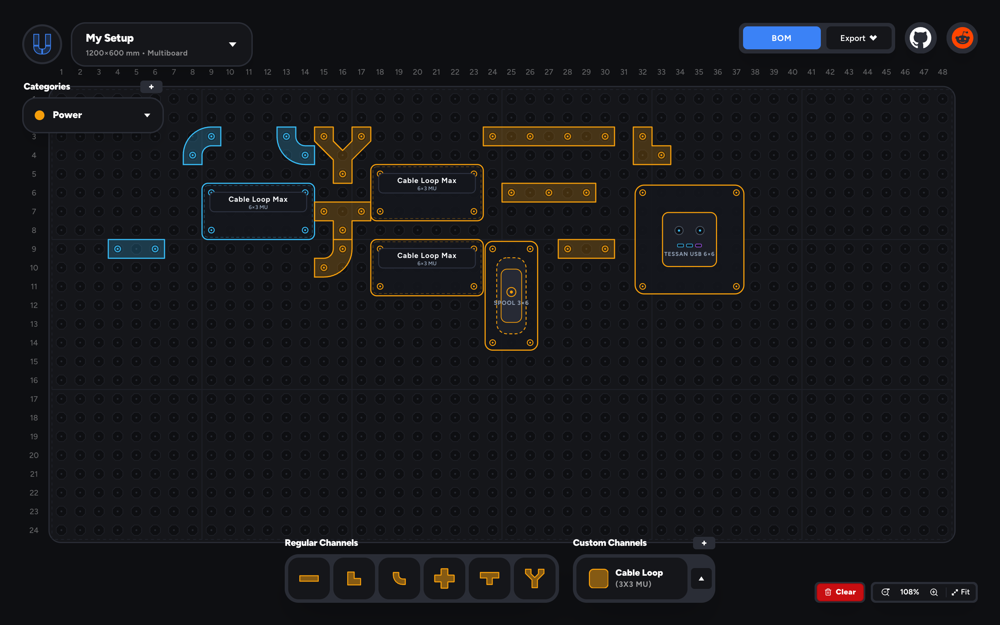
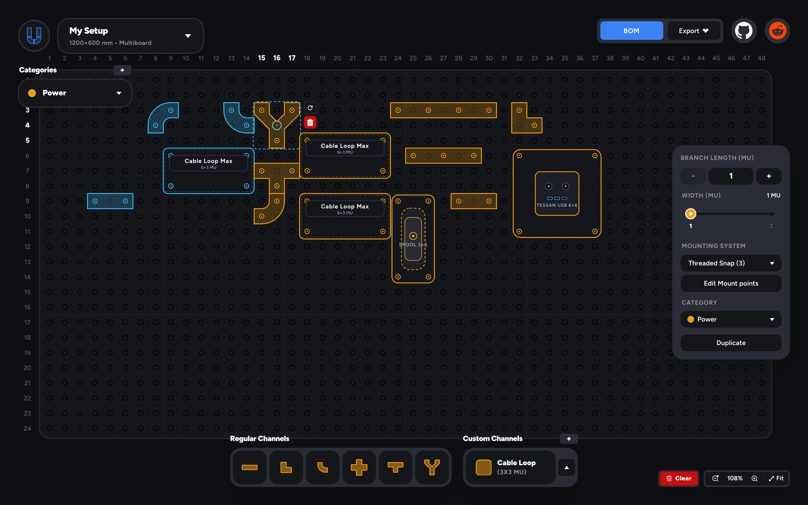
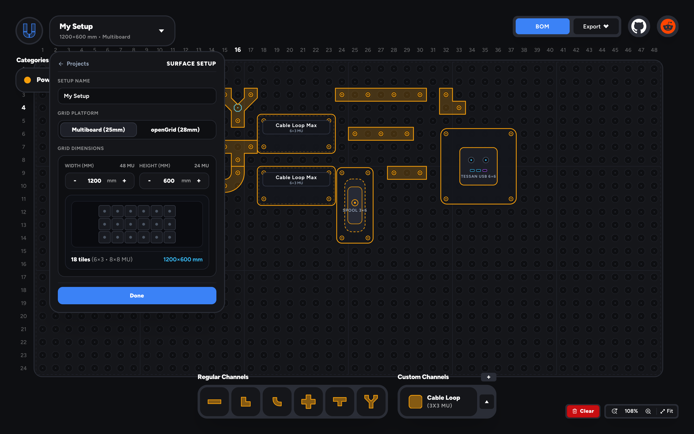
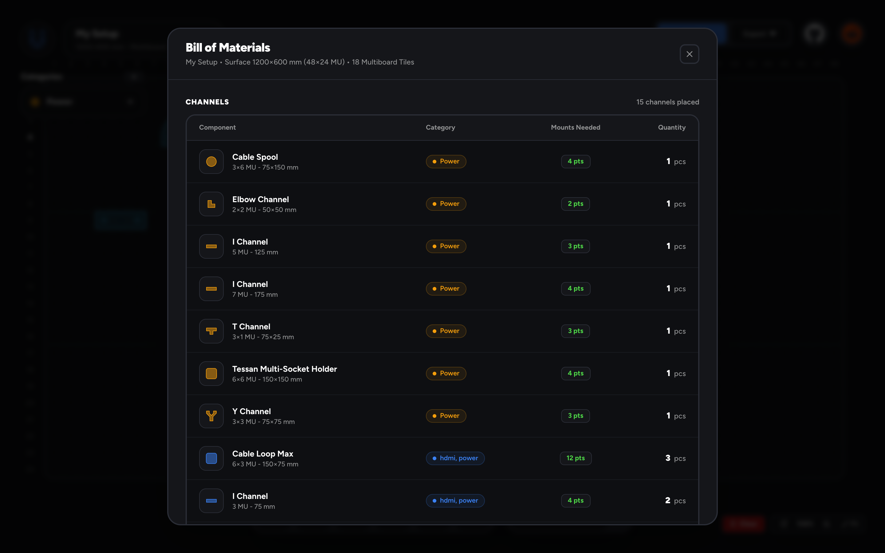

# Underplan ⚡🔌

[](LICENSE)
[](https://react.dev)
[](https://www.typescriptlang.org/)
[](https://vitejs.dev/)
[](tests/)

> **Plan your Underware cable-management layout before you print.**  
> A fast, polished visual 2D CAD planning tool for Underware 2.0 cable channels mounted on **KeepMaking Multiboard (25mm)** and **openGrid (28mm)** pegboard grids, featuring automated snap connector tallying and Bill of Materials (BOM) generation.



---

## 🌟 Overview

**Underplan** is an interactive, CAD-lite design application built for makers, desk-setup enthusiasts, and 3D printing hobbyists. Routing Underware cable raceways under a desk, shelf, or enclosure requires knowing the exact combination of channel segments, turns, and snap connectors needed to fit the underlying grid layout. 

Underplan solves this by providing:
1. **Interactive SVG Top-Down Planner:** Drag, drop, snap, and rotate modular Underware channels onto a 25mm Multiboard or 28mm openGrid coordinate matrix.
2. **Real-time Geometric Validation:** Instant visual feedback detecting channel collisions (red highlight) and out-of-bounds positioning (amber halo).
3. **Automated Bill of Materials (BOM):** Dynamically tallies tiles, channel parts by family, length, and radius, and computes required snap fasteners—including an automatic **+10% spare allowance** (rounded up) to cover 3D print defects or snap wear.
4. **Export & Sharing:** One-click CSV download (RFC-4180 compliant) and Markdown clipboard copy for forum posts, slicer queues, and hardware inventory.

---

## 🚀 Quickstart

### Prerequisites
- Node.js 18+ (tested on Node v20/v22)
- npm 9+

### 1. Install Dependencies
```bash
npm install
```

### 2. Start Development Server
```bash
npm run dev
```
Open [http://localhost:5173](http://localhost:5173) in your browser to start planning.

### 3. Run Automated Tests
```bash
npm test
```
Executes the native test suite covering geometry math, discrete rotations, collision algorithms, snap tallying, and acceptance criteria (105/105 passing tests).

### 4. Build for Production
```bash
npm run build
```
Creates an optimized, type-checked production bundle in `dist/`.

### 5. Generate High-Res Screenshots
```bash
npm run screenshots
```
Uses Puppeteer and headless Chrome to generate Retina-quality screenshots of the app in `docs/screenshots/`.

---

## 🛠️ Core Features

| Feature | Description |
| :--- | :--- |
| **Dual Grid Platforms** | Full native support for both **KeepMaking Multiboard (25mm pitch)** and **openGrid (28mm pitch)** ecosystems. |
| **Surface Setup & Blueprint Matrix** | Configure custom mounting surface dimensions (width × height in mm), choose tile sizes, and preview the partitioned print-bed tile matrix in real time. |
| **Comprehensive Channel Family** | Straight channels (lengths 1–16 units, widths 1–5 units), 90° Elbows, Smooth Radial Curves (R2–R5), 3-Way T-Junctions, 45° Y-Split Branches, 4-Way Crosses, Mitred corners, and Jog diagonals. |
| **Modular Accessories & Blocks** | Place and route around custom modular gear including Cable Loop Max, Underware Cable Spools, and Tessan Multi-Socket Holders. |
| **Interactive CAD Canvas** | Top-down SVG viewport featuring authentic octagonal/square snap holes, live grid-snapping, ghost placement preview, channel selection, drag-and-drop repositioning, and inline rotation controls. |
| **Zoom & Pan Controls** | Smooth canvas navigation with dedicated Zoom In/Out, Auto-Fit Central Board, and keyboard hotkeys (`+` / `-` / `0` / `Space`+drag / Wheel). |
| **Functional Cable Color Encoding** | Color-code cable pathways by functional category: **Power** (Amber), **Data / USB** (Cyan), **Video / DP** (Purple), **Network / Eth** (Emerald), and **Neutral** (Slate). |
| **Collision & Bounds Validation** | Dual-stage collision engine (AABB broadphase + grid-cell set narrowphase) detecting overlaps with pulsed red warning halos and boundary overshoots with amber halos. |
| **Live Bill of Materials (BOM)** | Persistent header telemetry and slide-out modal drawer detailing required tiles, channel parts, and snap fasteners. |
| **Smart Spare Snap Policy** | Automatically calculates snap connectors per segment type and applies a configurable **+10% spare rate** (rounded up) for printing safety. |
| **One-Click Export** | Download RFC-4180 standard CSV files or copy formatted Markdown specifications directly to the clipboard. |

---

## 📸 Interface & Workflow Gallery

### 1. CAD-Lite Planning Canvas & Overview
Full dark workspace with Multiboard/openGrid grids, floating channel docks, and functional color-coded cable pathways (Power, Data, Video, Network).


### 2. Contextual Channel Inspector & Parametric Sizing
Select any placed conduit to inspect physical dimensions (1 MU = 25mm / 1 OU = 28mm), change 90° discrete rotations, tune parametric lengths, configure mounting hardware, or edit manual snap anchors.


### 3. Surface & Grid Setup Configurator
Switch seamlessly between KeepMaking Multiboard (25mm) and openGrid (28mm), customize mounting dimensions, and preview the tile matrix blueprint.


### 4. Real-Time Bill of Materials (BOM) & Hardware Calculator
Interactive modal detailing exact 3D print part tallies, tile counts, and snap fastener counts with an automatic +10% spare safety margin. Export to CSV or copy to clipboard as Markdown in one click.


---

## 📐 Documented MVP Assumptions & Calculation Rules

Underplan uses explicit, standardized mathematical assumptions:

1. **Multiboard Grid Standard:**
   - **Hole Pitch:** Strictly **25.0 mm** center-to-center between octagonal mounting holes, matching the open KeepMaking standard.
   - **Standard Tile Size:** Standard 8×8 hole tile (200 mm × 200 mm physical dimension).
   - **Board Grid Unit:** 1 grid coordinate unit ($u$) = 1 octagon hole pitch = 25.0 mm.

2. **Underware Channel Dimensions:**
   - Channel bodies follow a low-profile 25mm nominal width matching 1 unit pitch.
   - Straight channels span $N$ units ($N \in \{2, 3, 4\}$).
   - L-Corner turns span a $2 \times 2$ unit footprint.
   - T-Junctions span a $3 \times 2$ unit footprint.
   - 4-Way Cross channels span a $3 \times 3$ unit cross footprint (5 occupied cells).

3. **Snap Connector Counting Rules:**
   - **Straight Channels:** 1 snap per unit length ($L$ units = $L$ snaps; e.g. I-2 needs 2 snaps, I-3 needs 3 snaps, I-4 needs 4 snaps).
   - **L-Corner Turn:** 3 snaps (two terminal ends + corner apex anchor).
   - **T-Junction:** 4 snaps (three conduit terminal ends + central junction anchor).
   - **4-Way Cross:** 4 snaps (four branch terminals).
   - **Spares Formula:** $\text{Spares} = \lceil \text{Base Snaps} \times 0.10 \rceil$ (if base snaps > 0).

4. **Coordinate System & Rotations:**
   - Origin $(0, 0)$ is at the top-left hole of the board.
   - Rotations are discrete 90° clockwise increments ($0^\circ, 90^\circ, 180^\circ, 270^\circ$).

---

## ⚠️ Known MVP Limitations

- **2D Top-Down Simulation:** Underplan plans the horizontal mounting plane. It does not simulate 3D vertical drop brackets, multi-layer Z-stacking raceways, or desk leg risers.
- **No Direct 3D CAD/STL Export:** Underplan generates comprehensive Bills of Materials and layout specifications; it does not slice STL files or communicate directly with slicers.
- **Client-Side In-Memory State:** All state is maintained locally in React memory. Reloading resets the canvas (you can save/export via CSV or copy BOM Markdown).
- **Simulated Hardware Specifications:** Fastener and channel geometry represent generalized prototype models of the Underware 2.0 and Multiboard ecosystem and should be verified against your specific printer tolerances and filament shrinkage.

---

## 📂 Project Structure

```
UnderPlan/
├── docs/
│   ├── screenshots/            # HiDPI Retina screenshots for repository showcase
│   ├── domain-assumptions.md   # Domain rules, snap math, and KeepMaking assumptions
│   ├── geometry-rules.md       # Dual-coordinate mathematics & collision algorithms
│   ├── qa-report.md            # Acceptance criteria verification matrix (AC-1 to AC-10)
│   ├── ux-spec.md              # UX flows, wireframes, keyboard hotkeys, and copy
│   └── visual-system.md        # CAD-lite dark graphite theme & design tokens
├── scripts/
│   └── capture-screenshots.mjs # Automated Puppeteer high-res screenshot capture
├── src/
│   ├── components/
│   │   ├── BOMBar.tsx          # Persistent bottom telemetry summary bar
│   │   ├── BOMDrawer.tsx       # Slide-out modal drawer with itemized tables & exports
│   │   ├── Canvas.tsx          # Top-down SVG planner canvas with octagon grid & snap
│   │   ├── Header.tsx          # Top nav bar with board size controls & actions
│   │   ├── InspectorPanel.tsx  # Channel configuration and property controls
│   │   ├── Toast.tsx           # Floating notification toast
│   │   └── ToolPalette.tsx     # Left channel library and tool selector
│   ├── data/
│   │   └── demoLayout.ts       # Realistic under-desk demo layout
│   ├── lib/
│   │   ├── bom.ts              # Pure BOM generator, CSV, and Markdown formatters
│   │   ├── geometry.ts         # Pure geometry, collision, and rotation math
│   │   ├── index.ts            # Library barrel re-export
│   │   └── types.ts            # Full TypeScript interfaces and domain types
│   ├── styles/
│   │   ├── index.ts            # Theme helper exports
│   │   ├── tokens.css          # Design token CSS custom properties
│   │   └── tokens.ts           # Design token JavaScript constants
│   ├── App.tsx                 # Main application state orchestrator
│   ├── index.css               # Global Tailwind CSS and custom styling
│   └── main.tsx                # React 18 DOM entrypoint
├── tests/
│   ├── bom.test.ts             # BOM aggregation, formatting, and spare tests
│   ├── geometry.test.ts        # Geometry, footprint, rotation, and collision tests
│   └── qa-acceptance.test.ts   # End-to-end acceptance tests (AC-1 to AC-10)
├── LICENSE                     # MIT License
├── package.json
├── tailwind.config.js
├── tsconfig.json
├── vite.config.ts
└── README.md
```

---

## 📄 License

This project is licensed under the [MIT License](LICENSE) - see the [LICENSE](LICENSE) file for details.

---

## 📜 Legal & Community Disclaimer

*Underplan is an independent, unofficial planning tool developed for portfolio and educational demonstration purposes. Multiboard is designed by Jonathan @ KeepMaking. Underware is designed by Hands on Katie and BlackjackDuck. Underplan is not affiliated with, endorsed by, or sponsored by KeepMaking, Multiboard, or Underware.*
