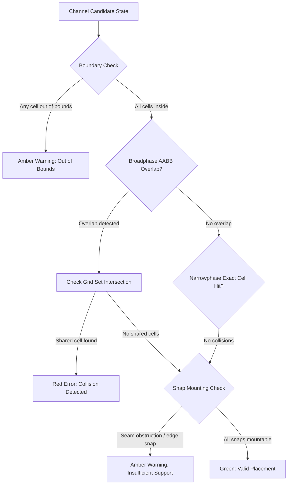

# Underplan — Domain Assumptions & MVP Geometry Specification

**Document Version:** 1.0.0  
**Status:** Approved Engineering Baseline  
**Domain:** KeepMaking Multiboard & Underware 2.0 Cable Management System  
**Target Application:** Underplan Web CAD-Lite Planner & BOM Generator  

---

## 1. Executive Summary & Domain Context

### 1.1 The Multiboard Standard (KeepMaking)
**Multiboard**, designed by Jonathan of KeepMaking, is an open-source modular 3D-printable pegboard and organizer system engineered around a standardized regular-octagonal grid.
- **Fundamental Grid Pitch:** Exactly **25.0 mm center-to-center** spacing between adjacent octagon holes.
- **Hole Profile:** Regular octagons (8 sides with 45° chamfers, flat horizontal top and bottom, vertical sides). The outer opening measures approximately 6.8 mm across the flats, with an inner central pilot peg hole of 2.5 mm.
- **Secondary Grid Offsets:** Interstitial 12.5 mm offset mounting features (quad-clusters) for secondary locking pins, brackets, and accessories.
- **Core Tile Form Factors:**
  - **8×8 Core Tile (Nominal Standard):** An 8×8 matrix of octagons ($8 \times 25\text{ mm} = 200\text{ mm}$ hole span; approximately $250\text{ mm} \times 250\text{ mm}$ physical tile boundary including interlocks and perimeter borders).
  - **4×4 Compact Tile:** A 4×4 matrix of octagons ($100\text{ mm} \times 100\text{ mm}$ hole span).
  - **Custom Arrays:** Tiled together edge-to-edge using perimeter interlocks and dual-snap joiners.

### 1.2 Underware 2.0 Cable Management System
**Underware**, created by Hands on Katie and BlackjackDuck, is a specialized modular cable-management raceway system engineered explicitly to mount onto Multiboard tiles.
- **Core Mechanism:** Modular U-channel raceways with clip-on or sliding lids that conceal, organize, and support power and low-voltage wiring underneath desks or on walls.
- **Mounting Snaps:** Rather than screwing directly into furniture, Underware channels attach to the Multiboard's octagonal holes using **Multiboard snaps**:
  - **Push-Fit / Click Snaps:** Dual-prong spring clips pressed directly into the octagon cavity for quick assembly.
  - **Threaded Snaps (with T-Bolts / Lock Rings):** Heavy-duty threaded inserts providing mechanical pull-out strength against gravity when loaded with heavy AC power cables.
- **Underware 2.0 Enhancements:** Chamfered cable drop-offs, segmented modular lengths, flush lid mating, and corner/junction routing fittings.

### 1.3 Underplan's Architectural Role
Underplan is a high-precision, 2D top-down planning tool that operates as the digital twin for Underware on Multiboard. It provides:
1. Instant visual placement of modular raceways on an authentic 25 mm octagonal canvas.
2. Immediate geometry validation (collision detection, boundary overhangs, snap hole alignment).
3. Deterministic generation of a physical **Bill of Materials (BOM)** detailing tile counts, channel parts, and snap fasteners (+10% spare policy) ready for 3D printing and hardware procurement.

---

## 2. Recommended MVP Channel Types

For the Underplan Minimum Viable Product (MVP), the channel catalog is constrained to five canonical, internally consistent geometries. This catalog provides 100% coverage for under-desk cable routing topologies (backbone highways, vertical drops, corner bends, and branch splits) while eliminating computational ambiguity.

```
       I-2                      I-3                         I-4
   [ O === O ]            [ O === O === O ]          [ O === O === O === O ]
    (50mm, 2U)               (75mm, 3U)                   (100mm, 4U)

         L-Turn (90° Elbow)                        T-Junction (3-Way)
             [ O ] (0,0) Port                       [ O === O === O ] Trunk (0,0..2,0)
               |                                            |
         [ O - O ] (0,1) Pivot & (1,1) Port               [ O ] Branch (1,1)
          (2x2 Footprint, 3 Cells)                  (3x2 Footprint, 4 Cells)
```

### 2.1 Catalog Summary Table

| Part Identifier | Catalog SKU | Geometry Classification | Discrete Span (Cells) | Physical Span | Nominal Footprint ($W \times H$) | Target Application |
| :--- | :--- | :--- | :--- | :--- | :--- | :--- |
| **Straight I-2** | `MB-CHAN-STR-2U` | Linear Raceway | 2 units | 50 mm | $2 \times 1$ | Tight bridges, edge drops, monitor arm jumpers |
| **Straight I-3** | `MB-CHAN-STR-3U` | Linear Raceway | 3 units | 75 mm | $3 \times 1$ | Standard routing segment, intermediate drops |
| **Straight I-4** | `MB-CHAN-STR-4U` | Linear Raceway | 4 units | 100 mm | $4 \times 1$ | Main backbone spine, rear perimeter highways |
| **L-Turn (90°)** | `MB-CHAN-CNR-2X2` | Right-Angle Elbow | 3 units (L-shape) | $50 \times 50\text{ mm}$ | $2 \times 2$ | 90° corner redirects, desk leg routing |
| **T-Junction** | `MB-CHAN-JNC-3X2` | 3-Way Branch Splitter | 4 units (T-shape) | $75 \times 50\text{ mm}$ | $3 \times 2$ | Drops from spine toward desk grommet/PC |

*(Note: 4-Way Cross `MB-CHAN-CRS-3X3` with a $3 \times 3$ footprint occupying 5 cells is architecturally reserved as a post-MVP catalog extension).*

### 2.2 Canonical Cell Coordinates ($0^\circ$ Rotation Reference)

All channel footprints are defined in local discrete coordinates $(x, y) \in \mathbb{N}_0^2$ with $(0, 0)$ anchored at the top-left cell:

1. **Straight I-2:**
   - Occupied Cells: `[(0, 0), (1, 0)]`
   - Bounding Box: Width = 2, Height = 1
2. **Straight I-3:**
   - Occupied Cells: `[(0, 0), (1, 0), (2, 0)]`
   - Bounding Box: Width = 3, Height = 1
3. **Straight I-4:**
   - Occupied Cells: `[(0, 0), (1, 0), (2, 0), (3, 0)]`
   - Bounding Box: Width = 4, Height = 1
4. **L-Turn (90° Corner):**
   - Occupied Cells: `[(0, 0), (0, 1), (1, 1)]`
   - Unoccupied corner cell in bounding box: `(1, 0)` is open space.
   - Bounding Box: Width = 2, Height = 2
5. **T-Junction (3-Way):**
   - Occupied Cells: `[(0, 0), (1, 0), (2, 0), (1, 1)]`
   - Unoccupied cells in bounding box: `(0, 1)` and `(2, 1)` are open space.
   - Bounding Box: Width = 3, Height = 2

---

## 3. Attachment-Point & Snap-Mounting Model

### 3.1 Grid Alignment Formula
The discrete-to-continuous mathematical mapping between the Multiboard octagon hole index and physical desk space is deterministic:

$$\text{Pitch } p = 25.0\text{ mm}$$
$$X_{\text{physical}} = x_{\text{grid}} \times p$$
$$Y_{\text{physical}} = y_{\text{grid}} \times p$$

- A discrete grid point $(x_{\text{grid}}, y_{\text{grid}})$ corresponds exactly to the geometric center of a Multiboard octagon hole.
- When an Underware channel is placed at grid coordinate $(X_0, Y_0)$ with rotation $\theta \in \{0^\circ, 90^\circ, 180^\circ, 270^\circ\}$, every occupied cell maps 1:1 to an underlying octagon hole.

### 3.2 Discrete Orthogonal Rotation Transform
In top-down SVG space where $+X$ points East and $+Y$ points South, rotating a local cell $(x, y)$ clockwise within a bounding box $(W, H)$ follows:

$$\text{Rot}_{90^\circ}(x, y) = (H - 1 - y,\, x)$$
$$\text{Rot}_{180^\circ}(x, y) = (W - 1 - x,\, H - 1 - y)$$
$$\text{Rot}_{270^\circ}(x, y) = (y,\, W - 1 - x)$$

After rotation, coordinates are translated so the minimum bounding box corner resets to local $(0, 0)$, ensuring consistent top-left anchoring.

### 3.3 Snap Locations & Mounting Philosophy

Under-desk installations subject 3D-printed channels to constant gravitational pull, cable sagging, and rotational torque when thick cables are routed around corners. Underplan defines explicit snap mounting requirements:

```
I-2 Snap Layout:       (S) ================ (S)
                      Cell 0               Cell 1           Total: 2 Snaps

I-3 Snap Layout:       (S) ======= (S) ======= (S)
                      Cell 0      Cell 1      Cell 2        Total: 3 Snaps

I-4 Snap Layout:       (S) ======= (S) ======= (S)
                      Cell 0      Cell 2      Cell 3        Total: 3 Snaps (Nominal)
                      [Alternative heavy-duty: 1 snap per cell = 4 Snaps]

L-Turn Snap Layout:    (S) Port (0,0)
                        |
                       (S) Elbow (0,1) === (S) Port (1,1)   Total: 3 Snaps

T-Junction Snap Layout: (S) Trunk W (0,0) == (S) Center (1,0) == (S) Trunk E (2,0)
                                                    |
                                            (S) Branch S (1,1)  Total: 4 Snaps
```

#### Detailed Channel Snap Rules:
1. **Straight I-2 (2 Snaps):**
   - Mounted at both terminal ends: Cell `(0, 0)` and Cell `(1, 0)`.
   - Every cell has a snap ($1\text{ snap / unit}$).
2. **Straight I-3 (3 Snaps):**
   - Mounted at terminal ends `(0, 0)`, `(2, 0)` and intermediate center support `(1, 0)`.
   - Provides rigidity preventing center sag under heavy cable bundles ($1\text{ snap / unit}$).
3. **Straight I-4 (3 Snaps Nominal; 4 Snaps Heavy-Duty):**
   - **Nominal Baseline:** 3 snaps positioned at terminal ends `(0, 0)` and `(3, 0)`, plus intermediate support at `(2, 0)` (or `(1, 0)`).
   - **Heavy-Duty Alternative (1 snap per unit):** 4 snaps (one in every hole: `(0, 0)`, `(1, 0)`, `(2, 0)`, `(3, 0)`).
   - **MVP Default Rule:** 3 snaps for I-4 provides sufficient mechanical holding force while minimizing print time and snap insertion friction.
4. **L-Turn (90° Corner — 3 Snaps):**
   - Mounted at entry port `(0, 0)`, elbow pivot `(0, 1)`, and exit port `(1, 1)`.
   - Snapping all three occupied cells prevents leverage wobble when cables exert lateral tension around the 90° bend.
5. **T-Junction (3-Way Branch — 4 Snaps):**
   - Mounted at all three terminal branch ports `(0, 0)`, `(2, 0)`, `(1, 1)` and the central intersection node `(1, 0)`.
   - Anchoring all four occupied cells prevents torsional twisting where three cable pathways converge.

---

## 4. Connector Counting Rules & BOM Heuristics

The Bill of Materials calculation is deterministic, automated, and updates reactively on every canvas interaction.

### 4.1 Snap Fastener Tally Formula
Snap requirements are calculated from all collision-free, placed channels:

$$\text{Base Snaps} = \sum_{c \in \text{Channels}} \text{SnapsRequired}(c)$$

Where $\text{SnapsRequired}(c)$ is:
- Straight I-2: **2 snaps**
- Straight I-3: **3 snaps**
- Straight I-4: **3 snaps** (nominal)
- L-Turn (90°): **3 snaps**
- T-Junction: **4 snaps**

### 4.2 The +10% Spare Rule (Manufacturing Resilience)
3D-printed snaps (especially FDM printed in PLA or PETG) are small, high-stress mechanical components. During under-desk assembly:
- Snap legs can suffer layer shear or delamination when pressed into tight-tolerance octagons.
- Snaps can snap during removal, repositioning, or over-tightening.
- Print failures or imperfect bed adhesion can leave individual snaps unusable.

To prevent assembly stalling, Underplan enforces an automatic **+10% Spare Allowance**, always rounded up to the next whole integer:

$$\text{Spare Snaps} = \begin{cases} \lceil \text{Base Snaps} \times 0.10 \rceil & \text{if } \text{Base Snaps} > 0 \\ 0 & \text{if } \text{Base Snaps} = 0 \end{cases}$$

$$\text{Total Snaps to Print / Order} = \text{Base Snaps} + \text{Spare Snaps}$$

*Example:* A layout with 14 channels requiring 38 base snaps yields $\lceil 38 \times 0.10 \rceil = 4$ spare snaps, giving a total of **42 snaps** in the BOM.

### 4.3 Threaded vs Push-Fit Snap Selection
Underplan designates **Multiboard Threaded Snaps (`MB-SNAP-CLICK` / `MB-SNAP-THREAD`)** as the primary hardware SKU:
- Under-desk installations run upside down; push-fit friction snaps can slowly back out over time under thermal cycling and heavy cable loads.
- Threaded snaps utilize an internal M4/M6-compatible printed thread or T-bolt locking mechanism, ensuring positive mechanical retention against the ceiling plane of the desk.

### 4.4 Tile Matrix & Tile-to-Tile Joiner Formulas
In addition to channel hardware, Underplan calculates the underlying Multiboard matrix requirements:

1. **Total Multiboard 8×8 Core Tiles:**
   $$\text{Total Tiles} = \text{Cols} \times \text{Rows}$$
2. **Internal Tile Seams:**
   $$\text{Internal Seams} = (\text{Cols} - 1) \times \text{Rows} + (\text{Rows} - 1) \times \text{Cols}$$
3. **Dual-Snap Seam Joiners:**
   Each shared seam between adjacent tiles requires 2 Multiboard Dual-Snap Joiners:
   $$\text{Dual-Snap Joiners} = \text{Internal Seams} \times 2$$

---

## 5. Collision & Placement Validation Rules

Underplan executes a real-time, two-stage geometric validation pipeline on every placement, drag, or rotation.



### 5.1 Validation Rules Matrix

| Severity Level | State Token | Hex Code | Trigger Condition | Visual Canvas Indicator | Inspector Feedback | BOM Treatment |
| :--- | :--- | :--- | :--- | :--- | :--- | :--- |
| **Error** | **Collision** | `#EF4444` (Rose / Red) | Two or more channels occupy the exact same grid cell coordinate $(x, y)$ | Red semi-transparent fill, pulsing 2px red border, diagonal crosshatch | `Collision: Overlaps channel #CH-XX at cell (X, Y)`. Resolution: *Separate Channels*. | Flagged with `(!)` warning. Not tallied in clean BOM total. |
| **Warning** | **Out of Bounds** | `#F59E0B` (Amber) | One or more cells of a channel fall outside the board hole matrix $[0 \le x < \text{totalX}, 0 \le y < \text{totalY}]$ | Dashed amber border (`6 3`), amber striped warning overlay on overhang area | `Warning: Channel extends N pegs outside board perimeter`. | Counted in channel tally, but flagged with boundary overhang badge. |
| **Warning** | **Insufficient Support** | `#F59E0B` (Amber) | Channel body is inside bounds, but one or more mounting snap holes cannot mount | Snap anchor point glows amber with exclamation icon | `Warning: Snap at (X,Y) falls on tile seam joiner or unmounted hole`. | Snap count auto-flags missing support; recommends repositioning. |
| **Success** | **Valid Placement** | `#10B981` (Emerald / Green) | All cells inside bounds, zero collisions, all snaps positively engage valid octagon holes | Solid stroke in category color, crisp circular snap markers | `Valid: Snapped to N Multiboard pegs`. | Fully aggregated into final print BOM. |

### 5.2 Specific Insufficient Support Scenarios
The "Insufficient Support" warning handles realistic physical edge cases:
1. **Tile Seam Collision:** A channel snap lands directly on an octagon hole occupied by a Multiboard Dual-Snap Tile Joiner securing two 8×8 tiles together.
2. **Perimeter Edge Proximity:** A channel's terminal snap sits on the outermost row/col where desk mounting bevels or frame chamfers obstruct snap insertion.
3. **Overhang Snaps:** A channel partially overhangs the board such that its terminal snap hole floats in mid-air off the edge of the Multiboard matrix.

---

## 6. Functional Cable Categories & Telemetry

Under-desk cable management fails when high-voltage alternating current (AC) is bundled tightly against sensitive low-voltage signals, causing electromagnetic interference (EMI), hum in audio equipment, and video dropouts. 

Underplan enforces a five-category functional routing system with high-contrast color tokens calibrated for dark graphite canvas backgrounds:

```
+-----------------------------------------------------------------------------------------------+
| CATEGORY          | COLOR TOKEN | HEX CODE  | GLOW FILTER              | INTENDED WIRING      |
+-------------------+-------------+-----------+--------------------------+----------------------+
| Power             | Amber 500   | #F59E0B   | rgba(245, 158, 11, 0.40) | AC mains, power strips|
| Data / USB        | Cyan 500    | #06B6D4   | rgba(6, 182, 212, 0.40)  | USB-C, Thunderbolt   |
| Video             | Purple 500  | #8B5CF6   | rgba(139, 92, 246, 0.40) | DisplayPort, HDMI    |
| Network           | Emerald 500 | #10B981   | rgba(16, 185, 129, 0.40) | Cat6/7 RJ45, Ethernet|
| Neutral / General | Slate 400   | #94A3B8   | rgba(148, 163, 184, 0.25)| Sleeves, audio, misc |
+-----------------------------------------------------------------------------------------------+
```

### 6.1 Category Details & Routing Best Practices

#### 1. Power (`#F59E0B` / Amber)
- **Cables Included:** 110V/230V AC power cords, power brick IEC cables, high-wattage USB-PD bricks, DC power supply lines.
- **Physical Characteristics:** Thick outer diameters (7–12 mm), stiff PVC jacketing, high EMI radiation.
- **Underplan Routing Rule:** Route along the rear spine of the desk (e.g. Straight I-4 highway). Maintain a minimum 50 mm (2 grid units) physical isolation from Data and Video runs wherever possible.

#### 2. Data / USB (`#06B6D4` / Cyan)
- **Cables Included:** USB4, Thunderbolt 3/4, USB-C 10Gbps/20Gbps, peripheral interconnects (keyboard, mouse, webcam, audio DAC).
- **Physical Characteristics:** Moderate diameter (4.5–6.5 mm), flexible, sensitive to high-frequency packet loss and ground noise.
- **Underplan Routing Rule:** Route through center-desk drops using T-Junctions from the main desk grommet to PC chassis.

#### 3. Video / Display (`#8B5CF6` / Purple)
- **Cables Included:** DisplayPort 1.4 / 2.1, HDMI 2.1, monitor power/display hybrid conduits.
- **Physical Characteristics:** Heavy braided jacketing (6.5–9.0 mm), rigid minimum bend radius (typically $> 40\text{ mm}$).
- **Underplan Routing Rule:** Use L-Turn (90° elbow) channels designed with gentle corner curves to avoid exceeding cable minimum bend radius under monitor arm clamp mounts.

#### 4. Network / Ethernet (`#10B981` / Emerald)
- **Cables Included:** Cat5e, Cat6, Cat6A shielded twisted-pair (STP/UTP), 10GbE DAC twinax, fiber patch cords.
- **Physical Characteristics:** Round or flat profile (3–7 mm), snagless RJ45 boot connectors.
- **Underplan Routing Rule:** Dedicated drops parallel to data trunks directly to switches or wall jacks.

#### 5. Neutral / Unassigned (`#94A3B8` / Slate)
- **Cables Included:** Split wire looms, braided sleeve bundles, audio 3.5mm lines, LED strip 5V/12V wiring.
- **Physical Characteristics:** Mixed profiles, structural tie-down anchors.
- **Underplan Routing Rule:** Default category for unclassified runs.

### 6.2 Channel Volumetric Capacity Guidelines
Standard Underware channels have an internal cross-section of approximately $20\text{ mm} \times 20\text{ mm}$ (400 mm² theoretical; ~240 mm² usable at 60% fill factor):
- **Power Capacity:** Maximum 2 standard AC mains cords (e.g., 3-conductor 14 AWG).
- **Data Capacity:** Maximum 5–6 standard USB-C / peripheral cables.
- **Video Capacity:** Maximum 2 thick shielded DisplayPort / HDMI cables.
- **Mixed Bundle:** 1 AC cord + 2 slim USB-C cables (caution: potential audio hum).

---

## 7. Simulated/Estimated vs. Official Manufacturing Specifications

To maintain absolute credibility with maker communities and avoid misleading users regarding physical 3D prints, Underplan establishes a rigorous boundary between what is mathematically modeled in the software versus official physical manufacturing specifications.

```
+---------------------------------------------------------------------------------------------------+
| ASPECT                  | UNDERPLAN MVP MODEL (SIMULATED)       | OFFICIAL MANUFACTURING SPECS    |
+-------------------------+---------------------------------------+---------------------------------+
| Grid Coordinates        | Discrete integer 25mm grid points     | CAD STEP geometry, +/-0.15mm    |
|                         | (Zero clearance gap between cells)    | shrinkage allowance per plastic |
+-------------------------+---------------------------------------+---------------------------------+
| Multiboard Holes        | Regular 2D octagons (8 sides, 45°)    | Chamfered 6.8mm flat-to-flat,   |
|                         | with 2.5mm center pilot dot           | 2.5mm peg, quad secondary pegs  |
+-------------------------+---------------------------------------+---------------------------------+
| Snap Hardware           | Uniform point count per channel       | Threaded snaps, push-fit snaps, |
|                         | +10% spare heuristic                  | torque rating, tensile pullout  |
+-------------------------+---------------------------------------+---------------------------------+
| Tile Interlocks         | Continuous tiled rectangle boundary   | Interlocking dovetails/keys,    |
|                         | (e.g. 6x3 = 18 tiles)                 | perimeter mounting screw holes  |
+-------------------------+---------------------------------------+---------------------------------+
| Channel Footprint       | Discrete 2D cell occupancy            | 1.6-2.0mm wall thickness, lid   |
|                         | (Collision = shared grid cell)        | snap lips, internal draft angles|
+-------------------------+---------------------------------------+---------------------------------+
| Cable Clearance / Bend  | Visual category color & nominal       | Physical cable outer diameter,  |
|                         | capacity heuristic                    | minimum dynamic bend radius     |
+-------------------------+---------------------------------------+---------------------------------+
```

### 7.1 What Underplan Simulates & Estimates

1. **Discrete Grid Topology:**
   - The canvas operates on idealized integer coordinates $(x, y)$ spaced at exactly 25.0 mm.
   - It assumes tiles snap together perfectly without thermal expansion gaps, seam tolerances, or desk bow.
2. **Collision Modeling:**
   - Overlaps are computed via discrete 2D cell set intersections. If two channels share cell $(x, y)$, a collision is triggered. Underplan does not simulate 3D vertical stacking (crossover bridges are planned for future versions).
3. **Snap Fastener Tally:**
   - Fastener counts follow discrete rules (2 for I-2, 3 for I-3, 3 for I-4, 3 for L-Turn, 4 for T-Junction).
   - The +10% spare count is an empirical planning heuristic designed to account for typical FDM printing failure rates and installation breakages.
4. **Tile-to-Tile Seam Joiners:**
   - Estimated as $2 \times \text{internal seams}$. Actual installation may use more or fewer joiners depending on desk surface rigidity and screw placement.

### 7.2 Official Physical Manufacturing Specifications

Users must refer to the official KeepMaking and Underware CAD repositories when slicing and printing physical parts:

1. **KeepMaking Multiboard Official Specs:**
   - **Tolerances:** Multiboard STL/STEP models feature engineered 0.15 mm to 0.25 mm clearance offsets optimized for standard 0.4 mm nozzles and 0.2 mm layer heights.
   - **Plastics:** PETG or PLA+ is recommended for core tiles; PLA is acceptable in non-load-bearing applications; ABS/ASA is recommended in high-temperature environments.
   - **Fastening Torque:** Push-fit snaps insert with ~15–25 N of hand force; threaded snaps should be tightened finger-tight plus 1/4 turn to avoid stripping printed threads.
2. **Underware (Hands on Katie / BlackjackDuck) Official Specs:**
   - **Wall Thickness:** Channel outer walls are designed at 1.6 mm (4 perimeters with a 0.4 mm nozzle) to provide structural stiffness without excessive print times.
   - **Lid Retention:** Underware 2.0 lids use integrated detent beads that click securely onto the channel body; lids can slide or pop off vertically for cable servicing.
   - **Cable Ports:** Terminal ends feature a 1.5 mm radius fillet on interior edges to prevent sharp plastic burrs from chafing cable jackets during installation pulls.

---

## 8. Summary Checklist for Engineering & QA

Developers implementing Underplan modules (`src/lib/geometry.ts`, `src/lib/bom.ts`, `src/lib/types.ts`) can verify functional compliance against this specification:

- [x] **Grid Pitch:** $1\text{ unit} = 25.0\text{ mm}$.
- [x] **Standard Tiles:** 8×8 octagons ($200\text{ mm}$ hole span).
- [x] **MVP Channels:**
  - Straight I-2: 2 cells, 2 snaps.
  - Straight I-3: 3 cells, 3 snaps.
  - Straight I-4: 4 cells, 3 snaps (nominal baseline).
  - L-Turn (90°): 3 cells ($2 \times 2$ box), 3 snaps.
  - T-Junction: 4 cells ($3 \times 2$ box), 4 snaps.
- [x] **Snap Spares:** $\lceil \text{Base Snaps} \times 0.10 \rceil$ added to all BOM outputs.
- [x] **Validation Rules:**
  - Red Collision on shared cell occupancy.
  - Amber Warning on perimeter overhang.
  - Amber Warning on obstructed/unsupported snap holes.
- [x] **Cable Categories:** Power (Amber `#F59E0B`), Data (Cyan `#06B6D4`), Video (Purple `#8B5CF6`), Network (Emerald `#10B981`), Neutral (Slate `#94A3B8`).
- [x] **Disclaimer:** Explicit demarcation in UI between CAD-Lite planning simulation and physical print manufacturing specs.
