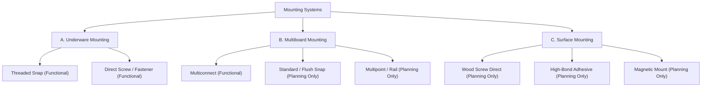

# Underplan — Mounting System Architecture & Specifications

> **Disclaimer & MVP Assumptions**  
> Underplan is an unofficial, community-driven visual planning tool for the KeepMaking Multiboard and Hands on Katie / BlackjackDuck Underware 2.0 ecosystem. It does NOT claim official manufacturing compatibility or authoritative production tolerances. All attachment point calculations, connector counts, and clearances are simulated estimates. Verify exact requirements in the official Multiboard/Underware configurators before 3D printing.

---

## 1. High-Level Mounting Taxonomy

Underplan categorizes mounting hardware across three functional domains:

---

## 2. Implemented Mounting Types (Current Release)

| Mounting Type | ID | Category | Status | Target Part | Sizing & Attachment Strategy |
| :--- | :--- | :--- | :--- | :--- | :--- |
| **Threaded Snap** | `threaded_snap` | Underware | **Functional** | Underware Channels (I, L, T, X) | Snaps pressed into Multiboard octagons with threaded ring. Min 2 per piece. +10% spare added in BOM. |
| **Direct Screw** | `direct_screw` | Underware | **Functional** | Heavy-duty Channels, Rigid Hubs | M3/M4 or bolt direct mounting through channel pilot hole into Multiboard weight-bearing snap or t-nut. 1:1 in BOM (no spare). |
| **Multiconnect** | `multiconnect` | Multiboard | **Functional** | Holders, Brackets, Cable Clips | Standardized David D / Multiconnect slide-in dovetail mount. Snaps into Multiconnect base. 1:1 in BOM. |

---

## 3. Planned Mounting Types (Marked "Prossimamente" / Planning Only)

To prevent fake precision, these options are visible in the library for layout exploration, but their BOM quantities are distinctly labeled as "Planning Only" without asserting exact mechanical specifications:

- **Standard / Flush Snap (`standard_snap`):** Flush push-fit snaps for tight under-desk clearances.
- **Multipoint / Rail Mount (`multipoint_rail`):** Continuous aluminum or printed extrusion rail clips.
- **Wood Screw (`wood_screw`):** Direct fastening into wooden desktop underside for perimeter anchoring without Multiboard.
- **High-Bond Adhesive (`adhesive`):** 3M VHB tape mounting for glass, metal, or non-drillable desks.
- **Magnetic Mount (`magnetic`):** Disc magnets embedded in snap cavities for removable power strip trays.

---

## 4. Contextual Mount Editing Model

In Underplan, connectors are never floating primary objects on the canvas:
1. **Primary Object:** The cable channel, bracket, or accessory.
2. **Contextual Selection:** Selecting a channel highlights its footprint and active mount locations.
3. **Mount Edit Mode (`isEditingMounts`):**
   - Movement and dragging of the parent object are temporarily locked.
   - Octagon holes within the channel footprint expand to generous interactive hit targets.
   - Selected mounts are rendered as prominent filled circles (Emerald/Cyan `#10B981` / `#38BDF8`).
   - Unused candidate mounting points appear as dashed rings (`#64748B`).
   - Click-to-toggle enables adding or removing mounts directly.
   - An "Auto Place Connectors" button resets mounts to the optimal mathematical placement.
   - If mounts fall below the recommended minimum (e.g. `< 2` for straight runs), an amber warning is raised.

---

## 5. BOM Integration & Rules

- **Threaded Snaps:** Base requirement computed per channel + 10% spare rounded up to the nearest integer.
- **Direct Screws:** Exact hardware count (screws + nuts), 0% default spare.
- **Multiconnect:** 1 connector per designated mounting socket.
- **Grouped Presentation:** BOM separates `UNDERWARE CHANNELS`, `SISTEMI DI FISSAGGIO (MOUNTING)`, and `MULTIBOARD TILES`.
