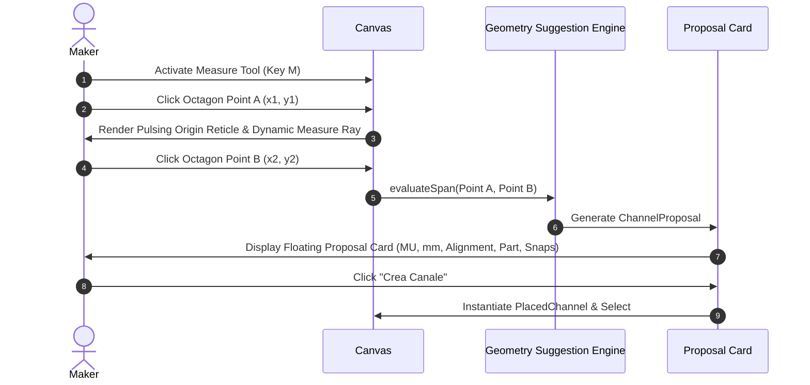

# Underplan — Parametric Components & Measure-to-Create Rules

> **Disclaimer & MVP Assumptions**  
> Units and dimensional relationships are model representations based on standard 25 mm KeepMaking Multiboard pitch ($1\text{ MU} = 25\text{ mm}$). All parametric calculations are visual and planning approximations intended to guide layout design before slicing and printing.

---

## 1. Unit System: Multiboard Units (MU)

- **Primary Unit:** **MU** (Multiboard Unit).
- **Physical Conversion:** $1\text{ MU} = 25\text{ mm}$ (center-to-center octagon pitch).
- **Display Convention:** Primary value in MU, accompanied by physical millimetres:
  `8 MU · 200 mm`
  `2×2 MU · 50×50 mm`

---

## 2. Parametric Component Definitions

### A. Canale Lineare (I-Channel / Straight)
- **Length ($L$):** $1\text{ MU}$ to $16\text{ MU}$ (discrete step: 1 MU).
- **Width ($W$):** $1\text{ MU}$ (standard slim, 25 mm) or $2\text{ MU}$ (wide trunk, 50 mm).
- **Height ($H$):** $1\text{ MU}$ (low-profile, 25 mm) or $2\text{ MU}$ (high-capacity, 50 mm).
- **Default Footprint:** $L \times W$ contiguous grid cells.
- **Default Mounting Points (Automatic):**
  - $L = 1$: 1 mount at $(0, 0)$.
  - $L = 2$: 2 mounts at $(0, 0)$ and $(1, 0)$.
  - $L \ge 3$: 2 terminal mounts at ends, plus intermediate mounts every 3 to 4 MU.

### B. Curva 90° (L-Channel / Elbow)
- **Arm Span ($S$):** $2\text{ MU}$ (standard 2×2), $3\text{ MU}$ (medium 3×3), $4\text{ MU}$ (large sweep 4×4).
- **Footprint:** L-shaped elbow connecting North and East ports around the corner.
- **Mounting Points:** Terminal port locations at both ends.

### C. T-Junction (3-Way Branch)
- **Primary Trunk Span ($P$):** $3\text{ MU}$ to $6\text{ MU}$ (default 3 MU).
- **Branch Span ($B$):** $2\text{ MU}$ to $4\text{ MU}$ (default 2 MU).
- **Footprint:** Continuous horizontal trunk with orthogonal center branch.
- **Mounting Points:** 3 terminal ports (West, East, South branch).

### D. Incrocio 4-Vie (X-Junction / Cross)
- **Span:** $3\times 3\text{ MU}$ or $4\times 4\text{ MU}$.
- **Mounting Points:** 4 terminal ports at North, South, East, West.

---

## 3. "Measure & Create Channel" Interaction Logic

The **Measure & Create Channel** tool (Shortcut: `M`) enables a maker to define a cable raceway by clicking two anchor holes on the board:

### Mathematical Suggestion Rules:
1. **Horizontal Alignment ($\Delta Y = 0, \Delta X > 0$):**
   - Suggests `straight` channel.
   - Length $L = \Delta X + 1\text{ MU}$.
   - Rotation: $0^\circ$ (if $x_2 \ge x_1$) or $180^\circ$.
   - Mounts: minimum 2, recommended $\max(2, 2 + \lfloor (L - 3) / 4 \rfloor)$.
2. **Vertical Alignment ($\Delta X = 0, \Delta Y > 0$):**
   - Suggests `straight` channel.
   - Length $L = \Delta Y + 1\text{ MU}$.
   - Rotation: $90^\circ$ or $270^\circ$.
   - Mounts: minimum 2, recommended $\max(2, 2 + \lfloor (L - 3) / 4 \rfloor)$.
3. **Diagonal Alignment ($\Delta X > 0, \Delta Y > 0$):**
   - Notice displayed: *“Nessun canale dritto compatibile in diagonale. Prova con un canale a L o segmenti ortogonali.”*
   - Suggests an L-Channel spanning the orthogonal bounding box ($\Delta X + 1 \times \Delta Y + 1\text{ MU}$) or sequential straight runs.
4. **Collision & Bounds Validation:**
   - Proposal card checks `canPlaceChannel` and flags any overlapping obstructions or perimeter violations before commitment.
