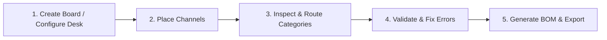

# Underplan — UX & Information Architecture Specification
**Document Version:** 1.0.0  
**Status:** Approved for Implementation  
**Audience:** Frontend Developers, Product Designers, QA Engineers  

---

## 1. Executive Summary & Product Vision

### 1.1 What is Underplan?
**Underplan** is a specialized, web-based visual layout and planning tool for under-desk cable management utilizing the open-source **Multiboard** mounting system. It enables users to visually map their under-desk surface with modular 3D-printed Multiboard tiles, route dedicated cable channels (power, data, video, network), immediately detect collisions and boundary violations, and instantly generate an accurate **Bill of Materials (BOM)** ready for 3D printing and hardware procurement.

### 1.2 The Problem
Under-desk cable routing with 3D-printed modular systems is fraught with trial-and-error:
- Miscalculating the number of tiles required for a given desk dimension.
- Printing channels that collide with desk legs, monitor arm clamps, or each other.
- Underestimating the required snap fasteners and mounting clips.
- Mixing high-voltage AC power cables with sensitive low-voltage data/audio cables, causing electromagnetic interference (EMI) and messy crossover junctions.

### 1.3 UX North Star Principles
1. **Zero-Setup Immediacy:** First render displays an interactive, pre-configured workspace with zero mandatory configuration modals.
2. **Tactile Digital Lego:** Placement, rotation, and alignment must feel like snapping physical blocks onto a pegboard (crisp grid snap, clear ghost previews, no arbitrary floating coordinates).
3. **Fail-Safe Visual Feedback:** Real-time geometry validation (collision detection, out-of-bounds warnings, and snap adequacy) flags errors before the user sends files to their 3D printer.
4. **Live, Actionable BOM:** Every placement, deletion, or category switch immediately updates the hardware count. Users always know the exact tile, channel, and snap tally down to the screw.
5. **Separation of Concerns:** Clear visual distinction between cable functional categories (Power, Data, Video, Network, Neutral) to encourage tidy, interference-free under-desk topology.

---

## 2. Core User Journey: The 5-Step Path



| Step | User Goal | Primary Interaction | System Feedback |
| :--- | :--- | :--- | :--- |
| **1. Create Board** | Match desk footprint with a Multiboard tile matrix. | Adjust `Columns × Rows` in top bar or pick a desk preset (e.g. *Standard Desk 6×3*). | Canvas resizes SVG tile grid dynamically; BOM updates tile count and total footprint dimensions. |
| **2. Place Channels** | Route channels along back and sides of desk. | Select channel from left toolbar (or press `1`–`5`), hover over canvas to see ghost snap, click to place. | Channel snaps to valid peg coordinates; snap fastener tally increments in the BOM. |
| **3. Inspect & Route** | Assign purpose (Power vs Data) and align angles. | Click placed channel; Inspector panel displays type, length, category palette, and rotation (`R`). | Channel fills with functional category color (e.g. Amber for Power, Blue for Data); rotation updates seamlessly. |
| **4. Validate & Fix** | Ensure no overlaps or boundary overhangs. | Visual scan of red/amber halos; Inspector displays error badge with plain-English resolution advice. | Overlapping segments turn semi-transparent red; Inspector shows "Collision: Overlaps Channel #3". |
| **5. Read BOM & Export** | Procure snaps, print tiles, and order channels. | Expand bottom BOM drawer, review tile count, channel list, and snaps (+10% spare); click "Export CSV" or "Copy BOM". | Formatted text copied to clipboard with toast notification; CSV file downloads for spreadsheet planning. |

---

## 3. Screen Layout & Workspace Architecture

### 3.1 Global Screen Layout Wireframe

```
+-------------------------------------------------------------------------------------------------------------------------+
| [LOGO] Underplan    | Presets: [ 6x3 (150x75cm) v ]  Cols: [ 6 ] Rows: [ 3 ] | [Load Demo] [Clear] | [Copy BOM] [Export v] |
+---------------------+---------------------------------------------------------+-----------------------------------------+
| TOOLBAR / LIBRARY   | SVG WORKSPACE CANVAS                                    | INSPECTOR PANEL                         |
|                     |                                                         |                                         |
| [V] Select Tool     |   +-------------------------------------------------+   | Channel Properties                      |
| [H] Hand / Pan      |   | [Tile 1,1] [Tile 2,1] [Tile 3,1] ...            |   | --------------------------------------- |
|                     |   |                                                 |   | Type:        Straight Channel (I-3)     |
| CHANNELS            |   |        [====== Power Run ======]  (Amber)       |   | Category:    [Power] Data Video Net ... |
| [=] Straight I-2    |   |                    |                            |   | Rotation:    [ 0° ] [ 90° ] [180°] ...  |
| [==] Straight I-3   |   |                    v (Data Drop) (Blue)         |   | Grid Pos:    Col 3, Row 1 (Peg 24, 8)   |
| [===] Straight I-4  |   |                                                 |   | Length:      3 grid units (150mm)       |
| [L] L-Turn (90°)    |   |   +---------------------------------------------+   | Snaps Req:   3 snaps                    |
| [T] T-Junction      |   |   | Canvas Overlay: Zoom [ - ] [ 100% ] [ + ] [Fit] |   | --------------------------------------- |
|                     |   +---+---------------------------------------------+   | Status:      [ OK: Valid Placement    ] |
| QUICK COLOR         |                                                         |                                         |
| (*) Power  (*) Data |                                                         | [ Duplicate ]        [ Delete Channel ] |
+---------------------+---------------------------------------------------------+-----------------------------------------+
| PERSISTENT BOM DRAWER (Collapsed: "18 Tiles | 14 Channels | 42 Snaps (+5 spare) | Total Footprint: 1500 x 750 mm" [^ Expand]) |
+-------------------------------------------------------------------------------------------------------------------------+
```

---

## 4. Detailed Component Specifications

### 4.1 Top Navigation Bar
The Top Nav acts as the global control hub for board configuration, preset loading, and export actions.

* **Left Section:**
  * **Brand Mark:** Underplan logo icon (hexagonal peg motif) + "Underplan" wordmark + "MVP" badge.
  * **System Status Indicator:** Subtle green dot (`All channels valid`) or amber dot (`2 warnings`).
* **Center Section (Board Geometry Controller):**
  * **Preset Dropdown Selector:**
    * *Compact Desk (4 × 2 tiles / 1000 × 500 mm)*
    * *Standard Desk (6 × 3 tiles / 1500 × 750 mm) — [Default]*
    * *Large Desk (8 × 4 tiles / 2000 × 1000 mm)*
    * *Custom Matrix...*
  * **Matrix Inputs:**
    * `Cols:` Numeric stepper input (Range: 1–16, step: 1).
    * `×`
    * `Rows:` Numeric stepper input (Range: 1–12, step: 1).
    * Dimension helper badge: `150 × 75 cm` (auto-calculated assuming 250mm standard Multiboard tile module).
* **Right Section (Actions):**
  * **Load Demo Button:** Secondary pill button with `Sparkles` icon (`Load "My Desk Setup"`).
  * **Clear Board Button:** Ghost button with `Trash-2` icon. Triggers a confirmation popover if canvas contains > 0 channels.
  * **Divider**
  * **Copy BOM Button:** Secondary button with `Copy` icon. Copies formatted Markdown BOM to clipboard.
  * **Export Button Group:** Primary split button with `Download` icon:
    * Primary action: `Export CSV`
    * Dropdown options: `Export CSV`, `Export JSON Layout`, `Print Setup Summary`.

---

### 4.2 Left Tool & Channel Library Panel
Width: `260px`, fixed on the left, high-contrast surface.

* **Section 1: Active Tool Selector (Segmented Toggle):**
  * `[V] Select / Move` (Pointer icon) — Selects, drags, and modifies placed channels.
  * `[H] Pan View` (Hand icon) — Pans canvas when zoomed in (or hold `Space`).
* **Section 2: Channel Library:**
  Each channel item is rendered as an interactive card displaying a mini SVG preview, title, grid dimensions, and snap fastener cost:

| Library Item | Geometric Spec | Peg Span | Snaps Required | Description |
| :--- | :--- | :--- | :--- | :--- |
| **Straight I-2** | Linear segment | 2 pegs (50mm) | 2 Snaps | Short jumper for tight spaces and drops |
| **Straight I-3** | Linear segment | 3 pegs (75mm) | 3 Snaps | Standard routing channel segment |
| **Straight I-4** | Linear segment | 4 pegs (100mm) | 4 Snaps | Long highway channel for spine runs |
| **L-Turn (90°)** | Right-angle elbow | 2 × 2 pegs | 2 Snaps | Corner redirect for perimeter routing |
| **T-Junction** | 3-way splitter | 3 × 2 pegs | 3 Snaps | Drop-off point from main trunk line |

* **Interaction on Channel Cards:**
  * **Click:** Activates "Placement Mode". Cursor transforms into ghost channel snapped to grid.
  * **Drag & Drop:** User can drag directly from library panel onto the canvas.
  * **Keyboard Accelerators:** Keys `1` through `5` trigger channels I-2, I-3, I-4, L, T immediately.

* **Section 3: Quick Category Picker:**
  Sets the category for newly placed channels:
  * `Power` (Amber / `#F59E0B`)
  * `Data` (Blue / `#3B82F6`)
  * `Video` (Purple / `#8B5CF6`)
  * `Network` (Emerald / `#10B981`)
  * `Neutral / Mixed` (Slate / `#64748B`)

---

### 4.3 Center SVG Canvas

The Canvas represents the under-desk surface. It is rendered using scalable SVG for sub-pixel crispness and high performance.

#### 4.3.1 Multiboard Grid Anatomy
* **Tile Grid:** Rendered as dark-gray rectangular tiles with subtle bevel borders.
* **Peg Matrix:** Each tile contains an 8×8 grid of Multiboard octagonal/circular mounting holes.
* **Pitch:** Standard Multiboard hole pitch is 25mm center-to-center.
* **Tile Bounds:** Highlighted with subtle white borders (`stroke-dasharray="4 2"`).
* **Grid Coordinate Labels:** Subtle column (A, B, C...) and row (1, 2, 3...) labels along top and left perimeter.

#### 4.3.2 Channel Placement & Rendering
* Channels are rendered as thick SVG capsule/path shapes sitting atop the peg grid:
  * **Channel Body:** Rounded rectangle/elbow path filled with category color at 85% opacity, with 2px solid stroke.
  * **Snap Anchor Points:** Circular markers representing Multiboard snap pins inserting into board pegs.
  * **Internal Cable Groove:** Visual dashed interior line conveying that cables run inside.
* **Ghost Preview State (during placement or dragging):**
  * Semi-transparent (50% opacity) channel adhering strictly to grid peg coordinates.
  * If coordinate is valid: Soft green halo (`stroke: #10B981`).
  * If coordinate collides: Soft red halo (`stroke: #EF4444`, `cursor: not-allowed`).
  * If out of board bounds: Amber warning halo (`stroke: #F59E0B`).

#### 4.3.3 Floating Canvas Controls (Bottom-Right or Bottom-Center)
* `[ - ]` Zoom Out (Step: 15%)
* `[ 100% ]` Reset to 1:1 scale
* `[ + ]` Zoom In (Step: 15%)
* `[ [ ] ]` Fit to Board (Zooms and pans to frame entire board matrix)
* `[ ? ]` Toggle Legend & Shortcut Cheat Sheet

---

### 4.4 Right Inspector Panel
Width: `300px`, fixed on the right. Displays contextual properties for the selected channel or board.

#### 4.4.1 Empty State (No Channel Selected)
* **Icon:** Large subtle cursor/pointer illustration.
* **Title:** `No Channel Selected`
* **Body:** *"Click any channel on the board to configure its category, rotation, or inspect errors. Or select a channel from the left panel to place a new one."*
* **Board Overview Card:**
  * Active Matrix: `6 × 3 Tiles`
  * Total Desk Area: `1500 × 750 mm (1.125 m²)`
  * Placed Channels: `14 channels`
  * System Health: `All clear (0 errors)`

#### 4.4.2 Active Selection State
When a channel is clicked/selected:
* **Header:**
  * Title: `Straight Channel (I-3)` (editable nickname or default ID, e.g. `#CH-04`)
  * Subtitle: `Placed at Tile B2 • Peg (14, 6)`
* **Properties Form:**
  1. **Category / Cable Purpose:**
     * Pill buttons with color badges: `Power`, `Data`, `Video`, `Network`, `Neutral`.
     * Changing selection updates the channel fill color and BOM classification in real time.
  2. **Rotation Control:**
     * Four-segment toggle: `0°`, `90°`, `180°`, `270°`.
     * Keyboard shortcut reminder: `Tip: Press 'R' to rotate`.
     * Rotation pivots around the channel's top-left anchor point without deselecting.
  3. **Dimensions & Geometry (Read-only):**
     * Span: `3 grid units (75 mm)`
     * Required Fasteners: `3 × Multiboard Standard Snaps`
  4. **Status & Validation Badge:**
     * **Valid:** Green pill badge with checkmark icon: `Valid Placement`.
     * **Collision:** Red pill badge with alert triangle: `Collision Detected (Overlaps #CH-02)`.
     * **Out of Bounds:** Amber pill badge: `Warning: Partially out of board bounds`.
* **Footer Actions:**
  * **Duplicate Button:** Secondary button (`Cmd+D` / `D`) — Spawns identical clone offset by +1 grid unit.
  * **Delete Button:** Danger outlined button (`Del` / `Backspace`) with trash icon.

---

### 4.5 Bottom Collapsible BOM Drawer
Persistent along the bottom of the screen. Always provides instant visibility into procurement requirements.

#### 4.5.1 Collapsed State (Header Bar — Height `44px`)
* **Left:** `BOM Summary` label with `Layers` icon.
* **Center Metrics Chips:**
  * `Tiles: 18 (6×3)`
  * `Channels: 14 pcs`
  * `Snaps Needed: 38 (+4 spare = 42)`
  * `Est. Print Time: ~14h 20m`
* **Right:**
  * Status indicator: `Valid` (green tag)
  * `[Copy BOM]` quick button
  * `[ ^ Expand BOM ]` toggle button

#### 4.5.2 Expanded State (Drawer — Height `280px` or full modal)
Divided into three structured columns:

```
+-------------------------------------------------------------------------------------------------------------------------+
| [v] BILL OF MATERIALS (BOM)                           [Filter: All Categories v]      [Copy Markdown]  [Export CSV] [X] |
+------------------------------------+---------------------------------------+--------------------------------------------+
| 1. MULTIBOARD TILES                | 2. CABLE CHANNELS                     | 3. FASTENERS & ACCESSORIES                 |
|                                    |                                       |                                            |
| Matrix: 6 cols x 3 rows            | Total Channels: 14 pcs                | Multiboard Snaps (Standard):               |
| Total 8x8 Tiles:     18 pcs        | - Straight I-4 (100mm):  6 pcs        |   Base requirement:    38 pcs              |
| Footprint:           1500 x 750 mm | - Straight I-3 (75mm):   4 pcs        |   +10% Recommended:    +4 pcs              |
| Total Pegs:          1,152 pegs    | - Straight I-2 (50mm):   2 pcs        |   Total to Print/Buy:  42 snaps            |
|                                    | - L-Turn 90°:            2 pcs        |                                            |
| Recommended Mounting:              | By Category:                          | Tile-to-Tile Joiners (Dual Snap):          |
| - Dual-sided Tape / Screws: 24 pts |   Power (Amber): 6 | Data (Blue): 5   |   Internal seam joints: 27 pcs             |
| - Corner Mounting Brackets:  4 pcs |   Video (Purp):  2 | Net (Green): 1   |                                            |
+------------------------------------+---------------------------------------+--------------------------------------------+
```

* **Action Bar:**
  * **`Copy Markdown`:** Generates clean Markdown table ideal for GitHub, Obsidian, or forum posts.
  * **`Export CSV`:** Downloads `underplan-bom-[timestamp].csv` with itemized SKU, name, quantity, category, and dimensions.
  * **`Print Summary`:** Opens a clean print stylesheet view with schematic and BOM checklist.

---

## 5. Validation & Conflict Detection Engine

To fulfill the "fail-safe" principle, Underplan executes client-side geometric validation on every state mutation (drag, place, rotate, resize).

```
   [ Channel Placed / Moved / Rotated ]
                   │
                   ▼
       ┌───────────────────────┐
       │ Boundary Check        │─── Overhang ──► Amber Warning: "Out of bounds"
       └───────────────────────┘
                   │
                  Pass
                   ▼
       ┌───────────────────────┐
       │ Overlap / Hit Test    │─── Intersection ──► Red Error: "Collision detected"
       └───────────────────────┘
                   │
                  Pass
                   ▼
       ┌───────────────────────┐
       │ Snap Hole Alignment   │─── Misaligned ──► Amber Warning: "Invalid snap hole"
       └───────────────────────┘
                   │
                  Pass
                   ▼
          [ Green: Valid ]
```

### 5.1 Validation Error Types & Visual Hierarchy

| Severity | Status Name | Color Token | Canvas Visual Representation | Inspector Feedback | BOM Impact |
| :--- | :--- | :--- | :--- | :--- | :--- |
| **Error** | **Overlap / Collision** | Red (`#EF4444`) | Crosshatched red diagonal fill, pulsing 2px red border on both intersecting channels. | `Collision: Overlaps channel #CH-02 at Pegs (12,4)-(14,4)`. Action button: *Separate Channels*. | Excluded from valid print total; marked with `(!)` in BOM. |
| **Warning** | **Out of Bounds** | Amber (`#F59E0B`) | Dashed amber border (`stroke-dasharray="6 3"`), striped warning overlay on overhang area. | `Warning: Channel extends 2 pegs outside right board edge`. | Included in BOM with warning badge. |
| **Warning** | **Insufficient Snaps** | Amber (`#F59E0B`) | Empty snap circles glow amber with exclamation mark. | `Warning: Long span requires at least 1 mid-point snap`. | Snaps tally auto-corrected to minimum requirement. |
| **Success** | **Valid Placement** | Green (`#10B981`) | Clean solid border, crisp snap anchor dots. | `Valid: Snapped to 3 Multiboard pegs`. | Fully tallied. |

### 5.2 The On-Canvas Legend
A persistent mini-legend sits in the bottom-left corner of the canvas (collapsible into a floating `[ i ]` button):

```
+-------------------------------------------------------------+
| LEGEND                                                  [x] |
| Cable Categories:                                           |
| [■] Power (AC)      [■] Data (USB/TB)   [■] Video (DP/HDMI) |
| [■] Network (RJ45)  [■] Neutral                             |
| Status Badges:                                              |
| [●] Valid (Green)   [▲] Warning (Amber) [X] Collision (Red) |
+-------------------------------------------------------------+
```

---

## 6. Onboarding & Sample Project: "My Desk Setup"

First-time users are presented with a zero-friction path to explore before building from scratch.

### 6.1 Empty State & Quick-Start Cards
When a user launches Underplan with an empty canvas, the center displays an interactive onboarding overlay card:

```
+---------------------------------------------------------------------------------+
|                                                                                 |
|                        ⚡ Welcome to Underplan ⚡                               |
|          Plan your modular under-desk Multiboard cable management               |
|                                                                                 |
|   [  ✨ Load "My Desk Setup" Demo  ]     or     [  + Start with Blank Board  ]  |
|                                                                                 |
|   Quick Tips:                                                                   |
|   • Press 1, 2, 3 to pick straight channels; 4 for L-Turn; 5 for T-Junction     |
|   • Press R while placing or selecting to rotate 90°                            |
|   • Watch the BOM drawer at the bottom update your 3D print count in real time  |
|                                                                                 |
+---------------------------------------------------------------------------------+
```

### 6.2 Canonical Demo: "My Desk Setup"
Clicking **Load Demo** instantiates a battle-tested cable management design demonstrating best practices in cable isolation and routing.

#### Routing Philosophy & Story
* **Desk Matrix:** 6 × 3 Multiboard tiles (1500 × 750 mm / standard 60×30 inch desk).
* **The Power Spine (Back Perimeter):**
  * Color: **Power (Amber)**
  * Layout: Run of three Straight I-4 channels spanning the rear edge (Tiles A1 → F1).
  * Purpose: Houses heavy AC power cords, power strip bricks, and monitor power cables away from user's legs.
* **The Data Trunk (Center Drop):**
  * Color: **Data (Blue)**
  * Layout: Begins with a **T-Junction** at tile C1, dropping down into two Straight I-3 channels toward tile C3.
  * Purpose: Routes USB-C, Thunderbolt dock cables, and peripheral hubs cleanly toward the desk grommet.
* **The Video Branch (Monitor Arm Drop):**
  * Color: **Video (Purple)**
  * Layout: Uses an **L-Turn** at tile D1 to branch off DisplayPort/HDMI lines directly under the desk monitor clamp.
* **The Network Run:**
  * Color: **Network (Green)**
  * Layout: Parallel I-3 channel alongside data trunk for shielded Cat6 Ethernet cable.

*This demo provides immediate sensory proof of the app's value: clean visual organization, zero collisions, distinct color routing, and an instant 42-part BOM.*

---

## 7. Keyboard & Mouse Interaction Model

Underplan is optimized for rapid desktop workflow using a dual-handed input model (left hand on keyboard shortcuts, right hand on mouse/trackpad).

### 7.1 Mouse & Trackpad Interactions

| Action | Context | Interaction | Visual Response |
| :--- | :--- | :--- | :--- |
| **Select / Inspect** | Canvas | Left Click on placed channel | Selection ring appears; Inspector populates with properties. |
| **Direct Move** | Canvas | Left Click + Drag placed channel | Channel detaches from grid, becomes semi-transparent ghost, snaps to nearest pegs under cursor. Release to commit. |
| **Quick Place** | Library / Canvas | Click library card → Move cursor to canvas | Ghost channel follows cursor snapped to pegboard; Left Click places channel; channel remains active for multi-placement until `Esc`. |
| **Pan Canvas** | Canvas | Space + Left Click Drag OR Middle-Click Drag | Hand cursor; canvas translates smoothly in X/Y. |
| **Zoom In / Out** | Canvas | Mouse Wheel / Trackpad Pinch | Smooth focal zoom centered on mouse cursor position (Bounds: 30% to 300%). |
| **Deselect All** | Canvas | Left Click on empty canvas tile | Selection cleared; Inspector reverts to board summary. |

### 7.2 Complete Keyboard Accelerator Matrix

| Key / Shortcut | Context | Functional Action |
| :--- | :--- | :--- |
| `V` | Global | Switch to **Select / Move Tool** |
| `H` | Global | Switch to **Hand / Pan Tool** |
| `1` | Global | Arm **Straight Channel I-2** for placement |
| `2` | Global | Arm **Straight Channel I-3** for placement |
| `3` | Global | Arm **Straight Channel I-4** for placement |
| `4` | Global | Arm **L-Turn (90°)** for placement |
| `5` | Global | Arm **T-Junction** for placement |
| `R` | Placement or Selection | **Rotate 90° clockwise** (cycles 0° → 90° → 180° → 270°) |
| `Del` / `Backspace` | Selection Active | **Delete** selected channel |
| `Cmd + D` / `Ctrl + D` | Selection Active | **Duplicate** selected channel |
| `Cmd + Z` / `Ctrl + Z` | Global | **Undo** last placement, move, or deletion |
| `Cmd + Shift + Z` | Global | **Redo** undone action |
| `Escape` | Global | Cancel current placement / Deselect active channel |
| `B` | Global | Toggle **BOM Drawer** (Expand / Collapse) |
| `+` / `=` | Global | Zoom in 15% |
| `-` | Global | Zoom out 15% |
| `0` | Global | Reset zoom to 100% |
| `Shift + 1` | Selection Active | Change category to **Power** |
| `Shift + 2` | Selection Active | Change category to **Data** |
| `Shift + 3` | Selection Active | Change category to **Video** |
| `Shift + 4` | Selection Active | Change category to **Network** |
| `Shift + 5` | Selection Active | Change category to **Neutral** |

---

## 8. BOM Calculation Rules & Data Structures

The Bill of Materials is deterministic and computed automatically from canvas state.

### 8.1 Calculation Formulas

1. **Multiboard Tile Matrix:**
   $$\text{Total Tiles} = \text{Cols} \times \text{Rows}$$
   $$\text{Desk Width (mm)} = \text{Cols} \times 250\text{ mm}$$
   $$\text{Desk Depth (mm)} = \text{Rows} \times 250\text{ mm}$$

2. **Channel Quantities:**
   Grouped by tuple: `(Type, Length, Category)`.
   Counts are exact tallies of currently placed, collision-free channels.

3. **Snap Fasteners (The 10% Policy):**
   Every channel requires snap fasteners to secure into the Multiboard peg holes:
   - Straight I-2: 2 snaps
   - Straight I-3: 3 snaps
   - Straight I-4: 4 snaps
   - L-Turn: 2 snaps
   - T-Junction: 3 snaps
   
   $$\text{Base Snaps} = \sum (\text{Channel Count} \times \text{Snaps per Channel})$$
   $$\text{Spare Snaps (10\%)} = \lceil \text{Base Snaps} \times 0.10 \rceil$$
   $$\text{Total Snaps to Print} = \text{Base Snaps} + \text{Spare Snaps}$$
   *(Note: Snaps frequently break during installation or post-processing; the +10% spare policy prevents printing stalls.)*

4. **Tile-to-Tile Joiners:**
   Calculated based on shared internal edges of the tile matrix:
   $$\text{Internal Seams} = (\text{Cols} - 1) \times \text{Rows} + (\text{Rows} - 1) \times \text{Cols}$$
   Each seam recommends 2 Multiboard Dual-Snap joiners:
   $$\text{Tile Joiners} = \text{Internal Seams} \times 2$$

---

### 8.2 Export Formats

#### 8.2.1 Markdown Export Format (`Copy BOM`)
```markdown
# Underplan — Bill of Materials (BOM)
**Configuration:** 6x3 Tiles (1500 x 750 mm)
**Generated:** 2026-09-06

### 1. Multiboard Base
- **8x8 Multiboard Core Tiles:** 18 pcs
- **Dual-Snap Tile Joiners:** 54 pcs
- **Estimated Desk Mounting Points:** 24 screws/tape pads

### 2. Cable Management Channels
| Channel Type | Category | Qty | Length | Snaps / Item | Total Snaps |
| :--- | :--- | :--- | :--- | :--- | :--- |
| Straight I-4 | Power (AC) | 6 | 100 mm | 4 | 24 |
| Straight I-3 | Data (USB) | 4 | 75 mm | 3 | 12 |
| Straight I-2 | Neutral | 2 | 50 mm | 2 | 4 |
| L-Turn (90°) | Video | 2 | 50x50 mm | 2 | 4 |
| **Total Channels:** 14 pcs | | | | | |

### 3. Fasteners & Hardware
- **Multiboard Standard Snaps:** 44 pcs (40 required + 4 recommended spares)
```

#### 8.2.2 CSV Export Format (`Export CSV`)
```csv
SKU,Item Name,Category,Quantity,Unit Dimension,Hardware Required,Notes
MB-TILE-8X8,Multiboard 8x8 Core Tile,Base System,18,250x250 mm,Screws or VHB Tape,Main grid
MB-SNAP-STD,Multiboard Standard Snap,Fastener,44,Standard Snap,None,Includes 10% print spares
MB-JOIN-DUAL,Dual Snap Tile Joiner,Fastener,54,Dual Snap,None,For internal tile seams
MB-CHAN-I4,Straight Channel I-4,Power,6,100 mm,4 Snaps each,Rear AC spine
MB-CHAN-I3,Straight Channel I-3,Data,4,75 mm,3 Snaps each,Center data drop
MB-CHAN-I2,Straight Channel I-2,Neutral,2,50 mm,2 Snaps each,Jumper segments
MB-CHAN-L90,L-Turn 90° Channel,Video,2,50x50 mm,2 Snaps each,Monitor branch
```

---

## 9. Microcopy & Interface Content Dictionary

Consistent, concise, and helpful copy prevents confusion.

| UI Element | Location | Exact Copy / Text | Tooltip / Helper Text |
| :--- | :--- | :--- | :--- |
| **Preset Selector** | Top Nav | `Preset: [Standard (6x3) v]` | "Select a preconfigured desk size" |
| **Cols / Rows** | Top Nav | `Cols: 6  Rows: 3` | "Number of 8x8 Multiboard tiles in grid" |
| **Load Demo** | Top Nav | `Load Demo` | "Load 'My Desk Setup' sample project" |
| **Clear Board** | Top Nav | `Clear Board` | "Remove all placed channels from the canvas" |
| **Clear Modal** | Popover | `Clear entire board? This will remove 14 channels.` | Buttons: `[Cancel]` `[Clear All]` |
| **Copy BOM** | Top Nav / BOM | `Copy BOM` | "Copy formatted Markdown BOM to clipboard" |
| **Export CSV** | Top Nav / BOM | `Export CSV` | "Download spreadsheet-ready CSV file" |
| **Category: Power** | Inspector | `Power (AC)` | "High-voltage lines, power strips, AC adapters" |
| **Category: Data** | Inspector | `Data (USB/TB)` | "Low-voltage USB, Thunderbolt, dock connections" |
| **Category: Video** | Inspector | `Video (DP/HDMI)` | "Display cables and monitor arm routing" |
| **Category: Network** | Inspector | `Network (Ethernet)` | "Cat5e/Cat6/Cat7 patch cables" |
| **Category: Neutral** | Inspector | `Neutral / General` | "Mixed or unclassified wiring" |
| **Rotate Button** | Inspector | `Rotate (R)` | "Rotate 90 degrees clockwise (Key: R)" |
| **Delete Button** | Inspector | `Delete Channel` | "Delete selected channel (Key: Del)" |
| **Duplicate** | Inspector | `Duplicate (Cmd+D)` | "Create an identical copy of this channel" |
| **Error: Collision** | Inspector / Canvas | `Collision: Overlaps channel #CH-02` | "Move this channel to free pegs to fix" |
| **Warning: Bounds** | Inspector / Canvas | `Warning: Overhangs board perimeter` | "Channel extends past the outer edge of your tiles" |
| **Success: Valid** | Inspector | `Valid Placement` | "All snap points align correctly with pegboard" |
| **Toast: Copied** | Screen Center | `BOM copied to clipboard!` | Auto-dismisses after 2.5 seconds |
| **Toast: Loaded** | Screen Center | `Loaded 'My Desk Setup' demo!` | Auto-dismisses after 2.5 seconds |

---

## 10. Visual Design Tokens & Theming

Underplan utilizes a modern, engineering-grade dark theme inspired by CAD and PCB design tools to minimize eye strain during planning sessions.

### 10.1 Color System

| Token Name | Hex Code | Tailwind Equivalent | Usage |
| :--- | :--- | :--- | :--- |
| `bg-canvas` | `#0F172A` | `slate-900` | Infinite canvas background |
| `bg-tile` | `#1E293B` | `slate-800` | Multiboard 8x8 tile body |
| `border-tile` | `#334155` | `slate-700` | Multiboard tile perimeter outline |
| `peg-hole` | `#0B1120` | `slate-950` | Pegboard mounting holes |
| `peg-hole-snap` | `#64748B` | `slate-500` | Snapped peg hole indicator |
| `cat-power` | `#F59E0B` | `amber-500` | Power channel fill |
| `cat-data` | `#3B82F6` | `blue-500` | Data channel fill |
| `cat-video` | `#8B5CF6` | `purple-500` | Video channel fill |
| `cat-network` | `#10B981` | `emerald-500` | Network channel fill |
| `cat-neutral` | `#64748B` | `slate-500` | Neutral channel fill |
| `status-valid` | `#10B981` | `emerald-500` | Valid badge and halo |
| `status-warning` | `#F59E0B` | `amber-500` | Out of bounds warning |
| `status-error` | `#EF4444` | `red-500` | Collision alert |
| `selection-ring` | `#38BDF8` | `sky-400` | Selected channel bounding ring |

---

## 11. Accessibility & Future Considerations

1. **High Contrast Color Blind Modes:** Channel colors must have distinct luminance and SVG hatching/patterns (e.g. diagonal stripes for power, dotted line for data) so that color-blind users can distinguish categories without relying strictly on hue.
2. **Keyboard Traversal:** Full tab-order navigation through Inspector fields; Arrow keys allow nudging selected channels by 1 grid peg unit.
3. **Screen Reader ARIA Live Regions:** Updating the BOM announcements (`BOM updated: 14 channels, 42 snaps`) via an `aria-live="polite"` region ensures non-sighted users can track modifications.
4. **Mobile & Tablet Touch Readiness:** While the desktop 2-handed mouse+keyboard model is primary, the touch target sizes for toolbar items and inspector controls are padded to minimum 44×44px for iPad and tablet usage.

---

## 12. Verification & Acceptance Checklist

Frontend engineering can verify implementation against these criteria:
- [ ] Top bar changes to `Cols` and `Rows` update canvas tile grid and BOM tile matrix instantaneously.
- [ ] Clicking any channel in the left library arms the cursor with a snapped ghost preview.
- [ ] Pressing `R` rotates ghost preview or selected channel clockwise by 90°.
- [ ] Dragging one channel over another triggers the red crosshatch collision halo and updates Inspector status to `Collision`.
- [ ] Dragging channel partially outside the board grid triggers the amber warning halo and Inspector warning.
- [ ] Clicking "Load Demo" populates the canonical "My Desk Setup" with 6×3 tiles, 14 channels, zero errors, and properly categorized Power/Data lines.
- [ ] Clicking "Copy BOM" copies a valid Markdown table with accurate +10% snap spare counts.
- [ ] Clicking "Export CSV" generates and downloads a `.csv` file with correct columns.
